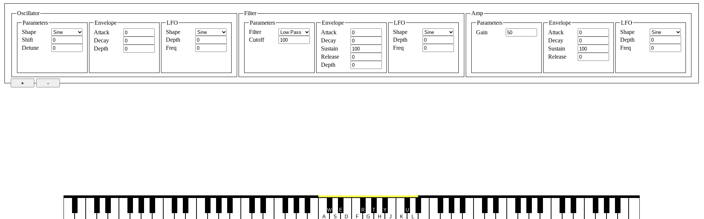

# Synth

A browser-based synth using the Web Audio API and HTML.

Very early stages of development.  Known bugs.  Need to get a working prototype quickly, will fix later.

## Features

* Polyphonic
* On-screen keyboard
    * Play by clicking mouse
    * Play by pressing corresponding qwerty keys
    * Drag "handle" to remap qwerty keys around keyboard
* MIDI Keyboard
    * Tested with M-Audio Keystation Mini 32
    * Volume knob will modify whichever parameter has focus
* Oscillators
    * Various wave forms
    * Shift and detune parameters
* Filters
    * Various pass/band types
    * Cutoff frequency parameter
* Amplifier
    * Gain parameter
    * ADSR envelope
* Parameters
    * Immediately update audio when changed
    * Have linear or exponential mappings for enhanced control, e.g. pitch shift (linear) or frequency cutoff (exp)
    * Can be continuous or discrete, e.g. detune (continuous) or pitch shift (discrete notes)
* LFOs can be synced for improved polyphony

## How To Run

Just download the repository and open `index.html` in a browser window.

## To Do

* Add named patches
* Use velocity from MIDI messages on key press
* Figure out how to stop polyphonic sounds from overloading the speakers
* Add option to export/import patches as JSON
* Add preset patches
* Add stereo sound
* Fix QWERTY mapping on black keys
* Automatically redraw keyboard when window is resized
* Add wood skins and metal skins etc.
* Add recording/editing functionality
* Add cool controllers (instead of just a keyboard)
    * Use the trackpad like a theremin?
    * Edit incoming audio files

