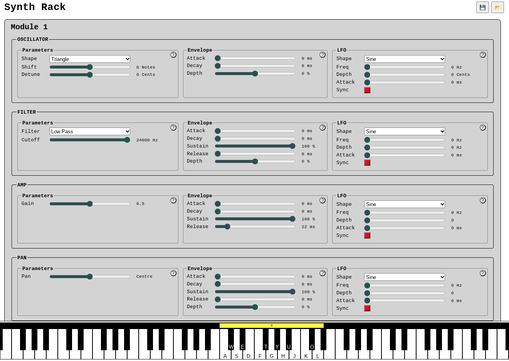

# Synth

A browser-based synth using the Web Audio API and HTML.

## Features

* Polyphonic
* On-screen keyboard
    * Play by clicking mouse
    * Play by pressing corresponding qwerty keys
    * Drag "handle" to remap qwerty keys around keyboard
* MIDI Keyboard
    * Tested with M-Audio Keystation Mini 32
    * Volume knob will modify whichever parameter has focus
* Oscillators
    * Various wave forms
    * Shift and detune parameters
* Filters
    * Various pass/band types
    * Cutoff frequency parameter
* Amplifier
    * Gain parameter
    * ADSR envelope
* Stereo panning
    * With LFO and envelope
* Parameters
    * Immediately update audio when changed
    * Have linear or exponential mappings for enhanced control, e.g. pitch shift (linear) or frequency cutoff (exp)
    * Can be continuous or discrete, e.g. detune (continuous) or pitch shift (discrete notes)
    * Right click to reset back to initial value
* LFOs
    * Can be synced for improved polyphony
    * Can use standard wave shapes or a random generator
* Import and export patches as JSON files

## How To Run

Just download the repository and open `index.html` in a browser window.

Or host it locally: `python -m http.server` and then open `localhost:8000` in your favourite browser.

(Currently only tested in Google Chrome).

## To Do

* Add preset patches
* Improve naming of input elements to assist screen readers
* Try reusing oscillators/nodes instead of creating/disposing
    * This doesn't seem necessary now I fixed the memory leak

## Future Considerations

* Create a noise oscillator
* Add reverb/echo/delay effects etc.
* Add recording/editing functionality
    * Basic sound capture/layering/playback
    * MIDI capture for editing and parameter automation
* Utilise key press velocity from MIDI messages
* Add "hold" button to keep keys pressed while editing
* Add a module mute button
* Add a master volume control
* Add other non-keyboard controllers
    * Use the trackpad like a thermin?
    * Modify incoming audio files
* Consider collapsible sections, i.e. modules or components
* Add wood skins and metal skins etc.

